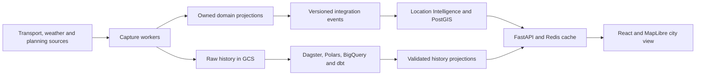

# UrbanPulse AU

**What is happening around my city right now, and how healthy is an area?**

UrbanPulse brings **Transport**, **Weather & Hazards**, and **Planning & Infrastructure** onto a Melbourne map. Watch the map update, inspect disruptions and warnings, and select an area to understand both today's conditions and its longer-term profile.

The first pilot is the City of Melbourne's **Southbank CLUE small area**, with tram positions and service status as the first transport slice. [Pilot decision](docs/adr/0002-southbank-tram-pilot.md).

## Architecture

Four domain boundaries connect live city signals to explainable area intelligence. Independent workers collect permitted raw history from the first transport slice, while the application serves current conditions.



The modular backend uses the same event contracts in process during the MVP and across durable delivery later. Current conditions and slower planning context retain their own source times and coverage. Area status starts with facts and reasons; numerical scoring follows a reviewed metric definition.

[Product brief](project_brief.md) | [Architecture](docs/architecture/overview.md) | [City demo scenario](docs/demos/city-mvp.md)

## Progress

Current priority: the [data pipeline track](docs/delivery-plan.md#data-pipeline-priority-track), with cloud source/static capture alongside Phase 1a normalized Tram schema and a one-day Parquet → GCS vertical slice. The schema is under review; raw expiry stays disabled.


| Phase | Outcome                                                                  | Status                                                                                                                        |
| ----- | ------------------------------------------------------------------------ | ----------------------------------------------------------------------------------------------------------------------------- |
| 0     | Reproducible local foundation                                            | Complete: [phase-0 release](https://github.com/maxtsec/urban-pulse-au/releases/tag/phase-0), demo and verified clean checkout |
| 1     | Area/map foundation and transport fixture slice                          | Complete: SRC-01 and CITY-01 with PostGIS/browser evidence; [fixture policy accepted](docs/adr/0004-southbank-fixture-map.md)                                                           |
| 2     | Weather + planning + integrated area view using shared in-process events | CITY-02 complete; CITY-03 complete; [CITY-04 complete](docs/adr/0008-in-process-city-composition.md); [weather-source policy accepted](docs/adr/0005-weather-source-policy.md), live-source gates remain open; phases 1-2 form the city MVP                                                                                         |
| 3     | Durable event delivery and recovery                                      | Complete: [A-05 option A accepted](docs/adr/0009-durable-event-delivery.md); [observation storage](docs/architecture/observation-storage.md) complete; [outbox/ledger](docs/architecture/outbox-ledger.md) complete; worker/recovery complete; [city checkpoints](docs/runbooks/city-checkpoints.md) complete; [performance evidence](docs/evidence/event-01-performance.md) complete; [planning copy optimization](docs/evidence/event-01-planning-copy-cost.md) complete; [city operations and Phase 3 acceptance evidence](docs/evidence/phase-3-acceptance.md) complete; production V1 follows the release acceptance criteria                                                                                                                       |
| 4     | Full application cloud deployment and operations                         | [DEMO-01 managed hosting and IAP accepted](docs/adr/0010-hosted-fixture-demo.md); [static web packaging](docs/evidence/demo-01-web-build.md) complete; [optional cache readiness](docs/evidence/demo-01-optional-cache.md) complete; [compiled web serving](docs/evidence/demo-01-web-serving.md) complete; [identity bootstrap](docs/runbooks/gcp-bootstrap.md) applied and read-only verified; branch protection verified; [image publishing](docs/evidence/demo-01-image-publishing.md) merged and first main publication verified; live denial evidence pending; [resource profile](docs/adr/0012-managed-demo-resource-profile.md) accepted; [foundation and private database initialization](docs/evidence/demo-01-database-bootstrap.md) applied and verified; [bounded API pool](docs/evidence/demo-01-api-pool.md) complete; [finite worker Job](docs/evidence/demo-01-city-job.md) complete; [finite migration/import Jobs](docs/evidence/demo-01-initialization-jobs.md) complete; [managed Job definitions](docs/evidence/demo-01-managed-jobs.md) complete; first managed Job executions and idempotent repeat verified; [managed serving configuration](docs/evidence/demo-01-managed-serving.md) merged; [consumer IAP access](docs/evidence/demo-01-consumer-iap.md) configuration complete; effective domain-policy preflight passed; protected fixture demo deployed; custom OAuth and named-user access complete; corrected candidate socket/readiness verified and candidate promoted to 100% traffic; previous revision retained for rollback; operator acceptance confirmed; [continuous delivery](docs/evidence/cd-01-managed-delivery.md) activated; first automatic zero-traffic candidate verified; protected promotion verified; live denial test remains pending; retained operational evidence is described in the serving record                                                                                                                       |
| 5     | Historical city analytics and governance evidence                        | Planned; completes the first city release                                                                                     |
| 6     | Evaluated scores, AI tools or subscriptions                              | Later, individually prioritised                                                                                               |

UI-DAY: [independent full-day synthetic explorer](docs/demos/synthetic-day.md) merged in PR #71, with two-hour windows, Live/History, local tram/construction models and authored weather.

MAP-01: [Southbank 3D building context](docs/demos/map-01.md) complete in [PR #47](https://github.com/maxtsec/urban-pulse-au/pull/47); [source and rendering evidence](docs/evidence/map-01-building-massing.md).

MAP-02 foundation: [compatible trip metadata and pinned Southbank shapes](docs/evidence/map-02-trip-foundation.md) implemented; [CBD geometry expansion](docs/evidence/map-02-cbd-expansion.md) verified with shared full-route assets. [Order-independent shape-pool build](docs/evidence/map-02-shape-pool.md) implemented offline, with an [opt-in shape/route loading comparison](docs/evidence/map-02-chunk-loading.md); [gzip/network/heap evidence](docs/evidence/map-02-route-validation.md) supports the route candidate. Production chunk selection and browser serving remain pending. The [two-observation interpolation core](docs/evidence/map-02-path-interpolation.md) and [exact timestamp helpers](docs/evidence/map-02-exact-time.md) are implemented independently; animation playback, CBD area UI and their rollout remain in the delivery plan.

The [raw tram collector](docs/evidence/cloud-01-raw-activation.md) is running on the dedicated encrypted host at 60/120/60 seconds, with fresh cloud heartbeat/capture/capacity streams and verified notification delivery. It retains raw locally without deletion; normalization, upload/confirmation and expiry remain in [CLOUD-01](docs/delivery-plan.md). [Bounded Weather/DAM reads](docs/evidence/src-02-weather-planning-probe.md) verified current model output and Southbank/CBD development records; continuous source policies and UI integration remain separate work.

The local Southbank demo connects retained synthetic events, revision checks, PostGIS and an area panel to a moving tram map. City overview combines modelled weather, warning lifecycles and a planning profile with source dates and building markers. Original single-domain scenarios remain in the test harness; the public UI uses the full-day synthetic explorer. The protected hosted fixture demo is available to its named operator; live capture and continuous delivery follow the [delivery plan](docs/delivery-plan.md).

[Run the Southbank demo](docs/demos/city-01.md) | [CITY-01 evidence](docs/evidence/city-01-fixture-map.md) | [Weather demo](docs/demos/city-02.md) | [Integrated planning demo](docs/demos/city-03.md)

## Fixture quickstart

Prerequisites: Git, uv, Node.js 24 LTS, npm and Docker Desktop. Run from the repository root. Installation needs internet access; fixture execution needs no provider/cloud credentials.

```powershell
powershell -NoProfile -ExecutionPolicy Bypass -File scripts/setup.ps1
docker compose up -d --wait
uv run --locked python -m urbanpulse.adapters.city_store migrate
uv run --locked python -m workers.ingestion.main --city-fixture
```

Start Docker Desktop before Compose. The city view uses PostGIS; fixture collection needs no provider credentials. Keep API/UI ports 8000 and 5173 free.

To inspect the Southbank map, start these in separate terminals:

```powershell
uv run --locked uvicorn apps.api.main:app --reload --host 127.0.0.1 --port 8000
```

```powershell
npm.cmd --prefix apps/web run dev
```

Open `http://127.0.0.1:5173/` for the [synthetic full-day explorer](docs/demos/synthetic-day.md). It is independent of the API. For the API-backed 360-second transport, weather and planning walkthroughs, build and open the separate [scenario test harness](docs/demos/city-01.md#run); production does not select scenarios through `?scenario=`.

For PostGIS/Redis, start Docker Desktop and run `powershell -NoProfile -ExecutionPolicy Bypass -File scripts/services-smoke.ps1`. See the [development guide](docs/development.md) for setup, configuration and troubleshooting.

## Documentation

The [document index](docs/README.md) links the brief, architecture, sources, tests and demos. Start source selection with the [source register](docs/source-register.md) and feature planning with the [delivery plan](docs/delivery-plan.md). [ADR 0001](docs/adr/0001-city-intelligence-scope.md) records the product boundaries and delivery principles.
