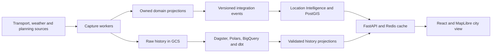

# UrbanPulse AU

**What is happening around my city right now, and how healthy is an area?**

UrbanPulse brings **Transport**, **Weather & Hazards**, and **Planning & Infrastructure** onto a Melbourne map. Watch the map update, inspect disruptions and warnings, and select an area to understand both today's conditions and its longer-term profile.

The first pilot is the City of Melbourne's **Southbank CLUE small area**, with tram positions and service status as the first transport slice. [Pilot decision](docs/adr/0002-southbank-tram-pilot.md).

## Architecture

Four domain boundaries connect live city signals to explainable area intelligence. Independent workers collect permitted raw history from the first transport slice, while the application serves current conditions.



The modular backend uses the same event contracts in process during the MVP and across durable delivery later. Current conditions and slower planning context retain their own source times and coverage. Area status starts with facts and reasons; numerical scoring follows a reviewed metric definition.

[Product brief](project_brief.md) | [Architecture](docs/architecture/overview.md) | [City demo scenario](docs/demos/city-mvp.md)

## Progress

| Phase | Outcome                                                                  | Status                                                                                                                        |
| ----- | ------------------------------------------------------------------------ | ----------------------------------------------------------------------------------------------------------------------------- |
| 0     | Reproducible local foundation                                            | Complete: [phase-0 release](https://github.com/maxtsec/urban-pulse-au/releases/tag/phase-0), demo and verified clean checkout |
| 1     | Area/map foundation and transport fixture slice                          | SRC-01 complete; CITY-01 complete with PostGIS/browser evidence; fixture policy acceptance and phase release remain open                                                           |
| 2     | Weather + planning + integrated area view using shared in-process events | CITY-02 complete; CITY-03 complete; [CITY-04 ready for review](docs/adr/0008-in-process-city-composition.md); [weather-source policy accepted](docs/adr/0005-weather-source-policy.md), live-source gates remain open; phases 1-2 form the city MVP                                                                                         |
| 3     | Durable event delivery and recovery                                      | Planned                                                                                                                       |
| 4     | Full application cloud deployment and operations                         | Planned                                                                                                                       |
| 5     | Historical city analytics and governance evidence                        | Planned; completes the first city release                                                                                     |
| 6     | Evaluated scores, AI tools or subscriptions                              | Later, individually prioritised                                                                                               |

An early capture track targets phases 1-2 in parallel, subject to source permission and cloud readiness. It does not gate phase 1 completion; capture gaps and their historical-analysis impact are tracked separately.

The local Southbank demo connects retained synthetic events, revision checks, PostGIS and an area panel to a moving tram map. City overview combines modelled weather, warning lifecycles and a planning profile with source dates and building markers. Original single-domain scenarios remain available. Live capture and hosted delivery follow the [delivery plan](docs/delivery-plan.md).

[Run the Southbank demo](docs/demos/city-01.md) | [CITY-01 evidence](docs/evidence/city-01-fixture-map.md) | [Weather demo](docs/demos/city-02.md) | [Integrated planning demo](docs/demos/city-03.md)

## Fixture quickstart

Prerequisites: Git, uv, Node.js 24 LTS, npm and Docker Desktop. Run from the repository root. Installation needs internet access; fixture execution needs no provider/cloud credentials.

```powershell
powershell -NoProfile -ExecutionPolicy Bypass -File scripts/setup.ps1
docker compose up -d --wait
uv run --locked python -m urbanpulse.adapters.city_store migrate
uv run --locked python -m workers.ingestion.main --city-fixture
```

Start Docker Desktop before Compose. The city view uses PostGIS; fixture collection needs no provider credentials. Keep API/UI ports 8000 and 5173 free.

To inspect the Southbank map, start these in separate terminals:

```powershell
uv run --locked uvicorn apps.api.main:app --reload --host 127.0.0.1 --port 8000
```

```powershell
npm.cmd --prefix apps/web run dev
```

Open [the local UI](http://127.0.0.1:5173) and [API documentation](http://127.0.0.1:8000/docs). The default City overview shows transport, modelled weather, warnings and planning together. Switch scenarios using the visible buttons. Use Play, Reset or the scenario moments to inspect moving, stale and last-known observations. Select a tram on the map or in the equivalent list.

For PostGIS/Redis, start Docker Desktop and run `powershell -NoProfile -ExecutionPolicy Bypass -File scripts/services-smoke.ps1`. See the [development guide](docs/development.md) for setup, configuration and troubleshooting.

## Documentation

The [document index](docs/README.md) links the brief, architecture, sources, tests and demos. Start source selection with the [source register](docs/source-register.md) and feature planning with the [delivery plan](docs/delivery-plan.md). [ADR 0001](docs/adr/0001-city-intelligence-scope.md) records the product boundaries and delivery principles.
