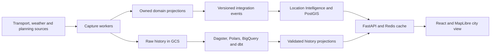

# UrbanPulse AU

**What is happening around my city right now, and how healthy is an area?**

UrbanPulse brings **Transport**, **Weather & Hazards**, and **Planning & Infrastructure** onto a Melbourne map. Watch the map update, inspect disruptions and warnings, and select an area to understand both today's conditions and its longer-term profile.

The first pilot is the City of Melbourne's **Southbank CLUE small area**, with tram positions and service status as the first transport slice. [Pilot decision](docs/adr/0002-southbank-tram-pilot.md).

## Architecture

Four domain boundaries connect live city signals to explainable area intelligence. Independent workers collect permitted raw history from the first transport slice, while the application serves current conditions.



The modular backend uses the same event contracts in process during the MVP and across durable delivery later. Current conditions and slower planning context retain their own source times and coverage. Area status starts with facts and reasons; numerical scoring follows a reviewed metric definition.

[Product brief](project_brief.md) | [Architecture](docs/architecture/overview.md) | [City demo scenario](docs/demos/city-mvp.md)

## Progress

| Phase | Outcome                                                                  | Status                                                                                                                        |
| ----- | ------------------------------------------------------------------------ | ----------------------------------------------------------------------------------------------------------------------------- |
| 0     | Reproducible local foundation                                            | Complete: [phase-0 release](https://github.com/maxtsec/urban-pulse-au/releases/tag/phase-0), demo and verified clean checkout |
| 1     | Area/map foundation and transport fixture slice                          | SRC-01 complete; area/event contracts in review; fixture map next                                                           |
| 2     | Weather + planning + integrated area view using shared in-process events | Planned; phases 1-2 form the city MVP                                                                                         |
| 3     | Durable event delivery and recovery                                      | Planned                                                                                                                       |
| 4     | Full application cloud deployment and operations                         | Planned                                                                                                                       |
| 5     | Historical city analytics and governance evidence                        | Planned; completes the first city release                                                                                     |
| 6     | Evaluated scores, AI tools or subscriptions                              | Later, individually prioritised                                                                                               |

An early capture track targets phases 1-2 in parallel, subject to source permission and cloud readiness. It does not gate phase 1 completion; capture gaps and their historical-analysis impact are tracked separately.

The runnable baseline is the synthetic fixture demo, with tested CloudEvents validation/revision comparison and a pure area-condition evaluator. These rules are not yet connected to the UI; city map/layers, live capture and cloud services follow. Hosted demo and recording: pending. Detailed acceptance, dependencies and decisions live in the [delivery plan](docs/delivery-plan.md).

[Run the fixture demo](docs/demos/phase-0.md) | [Local evidence](docs/evidence/phase-0-local.md)

## Fixture quickstart

Prerequisites: Git, uv, Node.js 24 LTS and npm. Run from the repository root. Installation needs internet access; fixture execution needs no provider/cloud credentials.

```powershell
powershell -NoProfile -ExecutionPolicy Bypass -File scripts/setup.ps1
uv run --locked python scripts/smoke.py
```

The smoke command starts temporary API and Vite servers on ports 8000 and 5173, checks HTTP/proxy connectivity, and stops them. Keep both ports free.

To inspect the fixture table, start these in separate terminals:

```powershell
uv run --locked uvicorn apps.api.main:app --reload --host 127.0.0.1 --port 8000
```

```powershell
npm.cmd --prefix apps/web run dev
```

Open [the local UI](http://127.0.0.1:5173) and [API documentation](http://127.0.0.1:8000/docs). The three synthetic observations preserve unknown and negative delay values.

For PostGIS/Redis, start Docker Desktop and run `powershell -NoProfile -ExecutionPolicy Bypass -File scripts/services-smoke.ps1`. See the [development guide](docs/development.md) for setup, configuration and troubleshooting.

## Documentation

The [document index](docs/README.md) links the brief, architecture, sources, tests and demos. Start source selection with the [source register](docs/source-register.md) and feature planning with the [delivery plan](docs/delivery-plan.md). [ADR 0001](docs/adr/0001-city-intelligence-scope.md) records the product boundaries and delivery principles.
