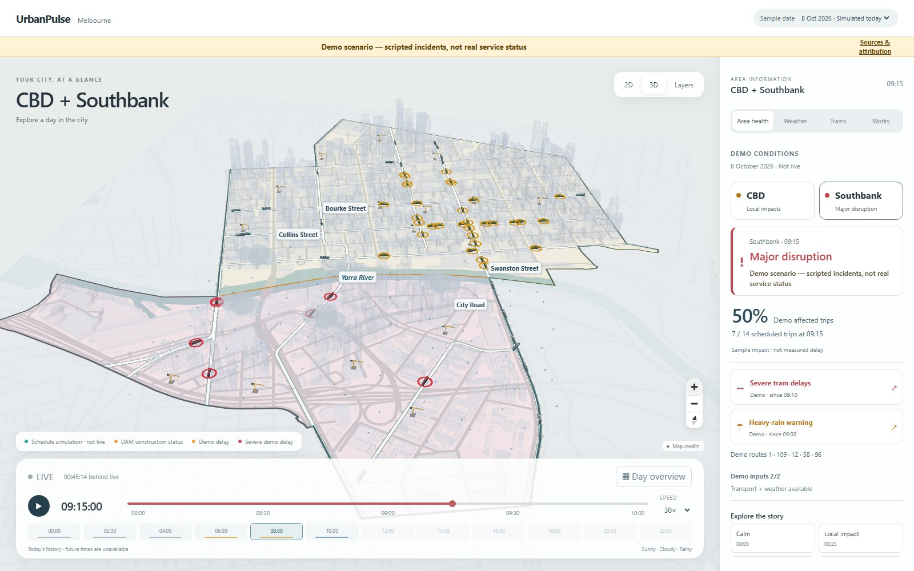
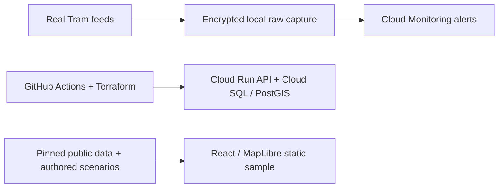

# UrbanPulse AU

**What is happening around my city right now, and how healthy is an area?**



Explore Melbourne CBD and Southbank through transport, weather and development activity. Switch between 2D and 3D, replay a day, and see what explains an area's condition.

The sample combines real buildings, streets, tram schedules and development records with **simulated tram movement, scripted incidents and synthetic weather**. It is not a live service-status map. [Sources and attribution](sample-data/README.md).

## What is real today

- **Continuous real Tram capture:** positions, trip updates and alerts collected on a dedicated encrypted host, with Cloud Monitoring heartbeat, feed-health and capacity alerts. [Activation and notification evidence](docs/evidence/cloud-01-raw-activation.md).
- **Terraform-managed GCP:** Cloud Run serving and Cloud SQL/PostGIS, with separate runtime identities and bounded database access. [Database deployment](docs/evidence/demo-01-database-bootstrap.md) · [Deployed serving revision](docs/evidence/cd-01-managed-delivery.md#executions).
- **Protected continuous delivery:** federated GitHub authentication, automatic zero-traffic candidates, operator-approved promotion and retained rollback targets. [CD execution evidence](docs/evidence/cd-01-managed-delivery.md).

These are running collection and deployed demo systems; the public sample remains separate from collected realtime data.

## Try it locally

With Node.js 24 and npm, run from the repository root:

```sh
npm --prefix apps/web ci
npm --prefix apps/web run dev
```

Open **http://127.0.0.1:5173/**. The sample runs without a backend or API keys. Start with **Day overview**, jump to a busy period, then compare CBD and Southbank.

## Architecture



The backend serves the protected fixture demo with durable events, idempotent processing and recovery tools. The next data path is **normalize → GCS → BigQuery/dbt → PostGIS**; that warehouse pipeline is still in development. [Architecture](docs/architecture/overview.md) · [Tests and evidence](docs/testing-strategy.md) · [Delivery plan](docs/delivery-plan.md)

## Repository guide

```text
apps/          FastAPI entry points and React web app
urbanpulse/    Domain rules, use cases, contracts and adapters
workers/       Capture, ingestion and event-processing entry points
pipelines/     Data pipeline workspace
migrations/    Versioned database changes
infra/         Terraform roots
ops/           Host and service configuration
scripts/       Builders, checks and operator tools
sample-data/   Pinned sample sources and attribution
tests/         Python unit and integration tests
docs/          Architecture decisions, demos and evidence
```

[Folder responsibilities](docs/repository-guide.md) · [Backend setup](docs/development.md) · [Sample walkthrough](docs/demos/schedule-sample.md) · [Documentation](docs/README.md)
