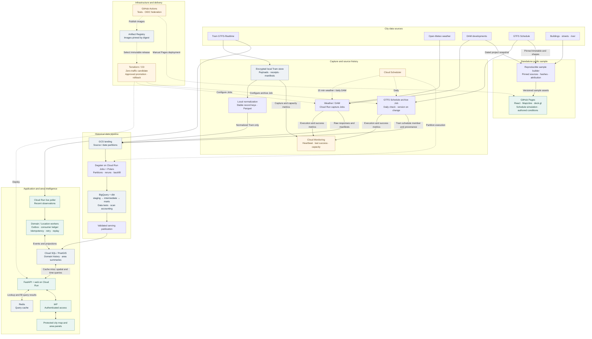
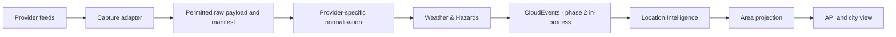
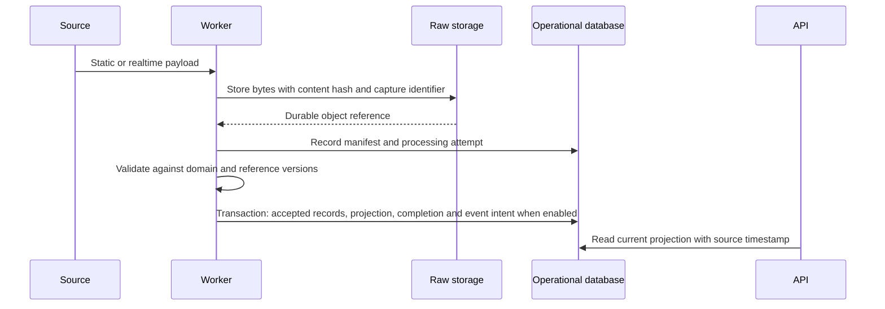

# Architecture overview

Design basis: [project brief revision 1](../../project_brief.md), sections 2-9 and 18. The brief selects the target technologies and an integrated Melbourne city product spanning transport, weather/hazards and planning/infrastructure. See the [delivery plan](../delivery-plan.md#implementation-baseline) for the executable baseline and progress. Open choices are in the [decision queue](../delivery-plan.md#decisions-needed-before-dependent-work).

## Runtime and module responsibilities

The target begins as a modular backend with independent runtimes. Bounded contexts describe ownership, not a requirement for four microservices.

| Bounded context           | Owns                                                                                             | Published information                                     |
| ------------------------- | ------------------------------------------------------------------------------------------------ | --------------------------------------------------------- |
| Transport                 | Train/tram/bus references, vehicle positions where supported, delay observations and disruptions | Current service facts and meaningful status changes       |
| Weather & Hazards         | Modelled readings/observations, warning validity, severity and affected geography                                  | Informational readings, applicable warnings and lifecycle changes                    |
| Planning & Infrastructure | Developments, works, infrastructure records and source status                                    | Area context and verified changes with source as-of dates |
| Location Intelligence     | Area identity, spatial/temporal combination, explained status and area history                   | Area summaries and meaningful AreaStatusChanged events    |

Implement a narrow source slice in each input domain for the city MVP. Exact area boundaries, spatial joins, schemas and status thresholds require decisions before implementation. Planning activity is slower-changing context; it only becomes a current disruption when a source supports that interpretation.

### Target architecture

The [README](../../README.md#target-architecture) provides the compact data-flow overview. This detailed design separates historical processing from current-condition queries. Solid arrows show data/query paths; dashed arrows show deployment/scheduling.



The home collector retains Tram raw locally; only normalized records enter GCS. The Cloud Run live poller supplies recent observations to Domain / Location workers independently of historical capture and warehouse publication. The host exposes no public endpoint. Both Tram consumers must share the provider quota budget; polling cadence and live display freshness follow their source-policy decisions.

Weather/DAM capture and GTFS Schedule archival use separate bounded cloud Jobs. Their source scopes, keyless permissions and cadences follow [ADR 0021](../adr/0021-independent-weather-planning-capture.md) and the [schedule archive design](gtfs-schedule-archive.md). The public sample shares licensed source datasets, not the protected API or realtime observations.

FastAPI uses Redis as a cache of query results: look up Redis, read PostgreSQL/PostGIS on a miss, then fill the cache. Redis is not a database proxy or durable ledger. Preserve source timestamps and bound database fallback as specified in the [cache policy](../../project_brief.md#8-redis-and-graceful-degradation).

Domain workers use [PostgreSQL outbox and consumer-ledger transactions](outbox-ledger.md) for reliable publication and consumption. Historical publication validates analytical results before updating serving data; current-condition processing does not wait for a warehouse batch.

### Runtime responsibilities

| Boundary                              | Responsibility                                                                       | Does not own                                       |
| ------------------------------------- | ------------------------------------------------------------------------------------ | -------------------------------------------------- |
| Domain/application modules            | Owned domain identities, temporal rules, area composition and use cases              | HTTP framework or provider wire formats            |
| Provider/storage/persistence adapters | Fetching, raw storage, databases and cache access through explicit contracts         | Business metric definitions                        |
| FastAPI                               | Validate HTTP requests and expose bounded query contracts                            | Feed polling or CPU-heavy transformation           |
| Ingestion worker                      | Poll/capture, validate, normalize and update current state with retry/reconciliation | Historical warehouse aggregation on every poll     |
| Dagster/Polars pipeline               | Coordinate partitions/backfills; file processing and bounded loads                   | Reimplementing dbt-owned metric SQL                |
| dbt/BigQuery                          | Analytical relations, tests and documented metrics                                   | Alembic-owned PostgreSQL schemas                   |
| Publication use case                  | Validate and publish bounded serving projections                                     | Pretending cross-store writes are atomic           |
| React                                 | City map, area panel, history, domain layers and accessible states                   | Database/cloud credentials or metric recomputation |

Code dependencies point inward: entry points/adapters depend on application contracts and domain rules. Domain logic has no imports from HTTP, database, cloud or orchestration frameworks. Composition at an entry point wires concrete adapters to use cases. Create an interface where there is an actual external boundary; avoid empty layers and speculative abstractions.

Shared configuration belongs in a neutral module; workers and pipelines must not depend on an API entry point. Package decomposition follows actual responsibilities.

## Data ownership

| Store or schema                | Target authority                                                                  | Recovery/ownership boundary                                              |
| ------------------------------ | --------------------------------------------------------------------------------- | ------------------------------------------------------------------------ |
| Cloud Storage                  | Permitted raw bytes, manifests/replay inputs and curated files                    | Local fixture storage is a development adapter                           |
| PostgreSQL operational schemas | Owned transport/weather/planning records, area projections and processing ledgers | Application transactions and Alembic migrations                          |
| BigQuery datasets              | Historical staging, dimensions, facts and marts                                   | dbt models/tests; isolated development/CI destinations                   |
| PostgreSQL serving schemas     | Published analytical projections for interactive queries                          | Rebuildable from a validated warehouse publication; Alembic owns schemas |
| Redis                          | Replaceable query cache                                                           | Original source/publication timestamps survive caching                   |
| Dagster metadata database      | Orchestration run state                                                           | Separate database and credentials from application data                  |

Cross-module reads use published interfaces, versioned exports or integration contracts. Contracts carry schema/publication versions where relevant. PostgreSQL and BigQuery are not competing owners of the same analytical result.

## Weather-source boundary

[ADR 0005](../adr/0005-weather-source-policy.md) keeps readings and warnings within one Weather & Hazards context. Open-Meteo provides informational modelled weather; verified weather-related VicEmergency products are the candidate warning slice; BOM may be added after source and product-policy review. Forecast features remain a later scope option.



Replay starts from retained captures. Domain contracts preserve source meaning and provenance; provider adapters do not call area assessment directly. Select aggregate boundaries and database fields for demonstrated needs, with compatible migrations for genuinely new concepts. Modelled readings cannot satisfy warning coverage; warnings retain original levels and are not merged across providers in the pilot. The diagram does not imply transactional raw storage or durable event delivery.

## Early cloud capture

A parallel track targets phase 1 for a small continuous collector and one GCS bucket after A-06 and source/retention decisions. It stores payloads and manifests independently of hosted API, event delivery and historical modelling. Weather and planning target phase 2 as source access becomes available. Capture readiness does not gate the phase 1 fixture slice.

Use scoped identity, protected credentials, rate budgets, timeouts, restart-safe object writes and durable capture metadata. Monitor successful capture age, rejected payloads, storage failures and gaps. Track the earliest retained source time, not just the first deployment time. Infrastructure definitions and lifecycle rules carry forward into the complete phase 4 deployment.

The collection-only path can finish after durable raw capture. The projection path below additionally validates and applies domain records; record these as separate outcomes so deferred processing does not appear as a failed capture.

## Target capture sequence



Failure rules from the brief: raw capture failure leaves the previous projection intact; invalid records/captures receive explicit quarantine reasons; reconciliation detects orphan objects and incomplete attempts; duplicate and overlapping observations must not produce duplicate canonical records. Late history can be retained without replacing newer current state. Exact keys and partial-rejection policy await the data contract.

## Integration events and area refresh

Illustrative contracts are TransportStatusChanged, WeatherWarningChanged and PlanningRecordChanged. Location Intelligence reads the published contracts, combines spatially and temporally relevant facts, and publishes AreaStatusChanged when the result changes. It does not read another domain's internal tables.

Use the CloudEvents 1.0 structured JSON envelope accepted in [ADR 0003](../adr/0003-cloudevents-and-area-conditions.md). The [capture/event contract](capture-event-contract.md) defines the initial wire profile and distinguishes it from the proposed capture/recovery design. The [area contract](area-contract.md) defines condition/coverage semantics, proposed fixture point rules and proposed warning policies. CONTRACT-01 prepares these boundaries before phase 2 publisher/handler implementation. The following table summarises their responsibilities:

| Envelope concern            | Required meaning                                                                 |
| --------------------------- | -------------------------------------------------------------------------------- |
| Event identity              | Stable identity for one meaningful change, preserved across retries              |
| Type and schema version     | Versioned event kind and payload compatibility                                   |
| Producer and source         | Domain owner, provider/product and source record identity                        |
| Aggregate identity/revision | Ordering scope and source-specific revision/precedence rule                      |
| Occurred/effective time     | Distinguish source event validity from capture and dispatch times                |
| Capture reference           | Trace back to permitted raw input and manifest                                   |
| Correlation/causation       | Link processing traces and derived events without asserting real-world causality |
| Typed payload               | Serializable domain facts; no ORM objects, SDK types or broker handles           |

A publisher port accepts this envelope; a handler port consumes it with explicit completion/failure outcomes. Phase 2 dispatches in process and tests serialization, duplicate identity and late updates. On failure or restart, reconcile derived state from persisted domain projections.

Phase 3 replaces delivery and adds durable publication intent, acknowledgements and consumer state through infrastructure/application adapters. Preserve the envelope and domain behavior across both adapters. Recovery tests, transactional wiring and migrations are still needed; swapping a transport alone does not establish durability.

Compare a PostgreSQL outbox with polling/consumer ledgers against a managed broker-backed design. The former can reduce moving parts; the latter can improve independent buffering/scaling but adds operational and cost choices. Neither is selected here. A broker does not solve consistency between a database commit and message publication by itself.

Required behavior:

- Recover publication intent after a crash following domain commit.
- Apply consumer effects idempotently and acknowledge only after their durable outcome.
- Prevent old updates from replacing newer state; preserve corrections and permitted history.
- Bound retries with backoff, classify permanent failures and retain diagnosable dead-letter records.
- Replay through the same validation/identity rules, with explicit operator scope and audit.
- Re-evaluate time-driven expiry even if no new warning arrives.
- Preserve per-source freshness when refreshing projections or cache entries.

Area transitions need approved examples and versioned rules. Unknown coverage cannot silently become normal, and warning expiry cannot imply full recovery if transport remains disrupted. Development intensity stays in the area profile unless an approved rule says otherwise.

Bounded polling can deliver UI snapshots first. SSE is a proposed one-way update mechanism with reconnect/resnapshot behavior; WebSockets require a bidirectional use case. The browser stream and internal event delivery are separate contracts. Notifications, a gateway and additional CQRS infrastructure are introduced only for demonstrated needs.

## Target publication sequence

```mermaid
sequenceDiagram
    participant Pipeline as Dagster pipeline
    participant BQ as BigQuery and dbt
    participant PG as PostgreSQL serving
    participant API
    Pipeline->>BQ: Build isolated candidate for publication identifier
    Pipeline->>BQ: Run structural and business quality checks
    alt Quality gate passes
        Pipeline->>PG: Export bounded candidate to staging tables
        Pipeline->>PG: Verify schema, counts and expected totals
        Pipeline->>PG: Transactionally switch publication pointer
        API->>PG: Read the selected publication
    else Quality gate fails
        Pipeline->>Pipeline: Record failure; preserve previous publication
    end
```

An export or verification failure also preserves the previous serving publication. GCS, BigQuery and PostgreSQL do not share a transaction. Persist transfer state, retry idempotently and reconcile interrupted work. Interactive requests read serving projections; a direct warehouse exploration API would require separately reviewed limits and execution behavior.

## Contracts that need definition before implementation

- Source contract: per-domain access, terms, redistribution/retention, rate limits, spatial coverage and transport static/realtime join evidence.
- Domain and area contract: area IDs/boundary versions, warning update/expiry, planning snapshot identity and as-of dates, spatial/temporal joins and partial coverage.
- Observation contract: provider/service date/trip/stop sequence/event/time grain, deduplication keys, late events, DST and times beyond midnight.
- Metric contract: future area score rules and uncertainty; reported delay distribution, eligibility, predicted/observed distinction, sampling, missing values, cancellations, sample count, coverage and metric version.
- API/UI contract: bounded queries, source/publication timestamps, loading/empty/error/stale/insufficient-data states and accessible chart/table alternatives.
- Cache contract: keys/versions, TTL, invalidation races, stale limits and bounded fallback. Refreshing a cache entry must not refresh the source timestamp.

OpenAPI and dbt will own generated field/model references. Schema diagrams and examples should explain the contract rather than duplicate every generated field.

## Operational constraints

Bind local services to loopback. Keep administrative pipeline/telemetry surfaces separate from public freshness information. Cloud execution needs scoped identities, compatible regions, explicit secret handling and cost controls before provisioning. The brief's latency and throughput figures are proposed targets, not measured results.

Architecture changes should include an ADR explaining alternatives, consequences and evidence for revisiting the decision. Do not treat scaffold shortcuts as accepted architecture decisions.


### Weather fixture path

CITY-02 retains authored weather payloads alongside the city capture. Application orchestration calls a fixture normalization port, passes published weather CloudEvents to Location Intelligence and evaluates warning polygons through PostGIS. The area API presents independent modelled information, warning lifecycle, source receipt and coverage. [Weather contract](weather-fixture-contract.md) records the boundaries; [CITY-04 composition](city-04-composition.md) defines shared delivery and persisted reconciliation.


## Planning fixture profile

CITY-03 extends the retained city bundle with synthetic DAM-shaped complete snapshots. Planning publishes a typed full snapshot; Location Intelligence applies revision receipts and PostGIS point membership, then serves original statuses and source dates separately from current conditions. Partial, rejected and failed attempts cannot clear the profile. Snapshot absence follows [ADR 0007](../adr/0007-planning-fixture-profile.md); [contract](planning-fixture-contract.md) and [demo](../demos/city-03.md) define acceptance. The shared delivery/recovery boundary is defined in [ADR 0008](../adr/0008-in-process-city-composition.md).


## In-process composition and recovery

An explicit fixture import normalizes transport, weather and planning inputs into owner-specific PostgreSQL revision and observation tables. Alembic owns the schema. Serving loads a consistent export through the persistence adapter; it never runs import or migrations. The API preserves its scenario/clock interface and returns 503 when inputs or dependencies are unavailable.

Each request reconstructs disposable Location projections through serialized CloudEvents and publisher/handler ports. Effects and receipts commit together in memory, transient handler retries are bounded, and time checkpoints cause expiry/coverage reevaluation. Context includes bundle, scenario policy, boundary, rules and clock. Rewinding cannot mutate another request's view. A fresh process uses the same persisted history and original identities.

The `composition` response includes typed source coverage and deterministic area transitions. Planning contributes the profile independently of current conditions. Retained raw fixtures remain import evidence; serving/restart uses normalized exports. Full reconstruction is deliberate for the bounded pilot; consumer persistence and durable notifications belong to EVENT-01. See [ADR 0008](../adr/0008-in-process-city-composition.md) and the [recovery demo](../demos/city-04.md).
