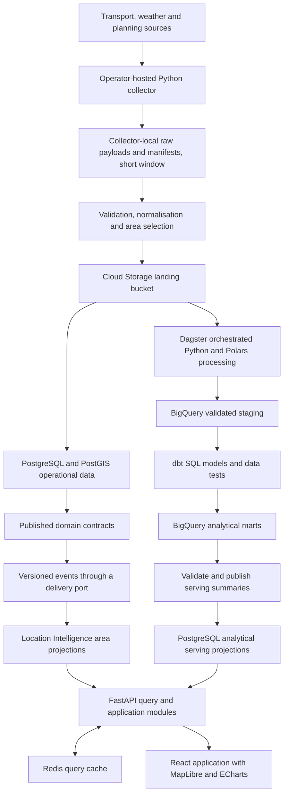

# UrbanPulse AU Project Brief

Brief revision: 1
Updated: 5 October 2026

UrbanPulse AU is a city intelligence platform, starting with Melbourne. It answers:

> What is happening around my city right now, and how healthy is an area?

Transport, Weather & Hazards, and Planning & Infrastructure supply distinct views of the city. Location Intelligence combines their published information into an area view with reasons, timestamps and coverage. Transport is the first implementation slice, not the whole product.

The selected foundation is Python/FastAPI, React/TypeScript, a modular backend with independent workers, PostgreSQL/PostGIS, Redis, Cloud Storage, Dagster/Polars and BigQuery/dbt on GCP. Cross-domain city information forms the MVP; raw history collection starts alongside the first transport slice, and warehouse depth and evaluated AI tools follow the integrated city experience.

## 1 Product scope

### The city experience

The home screen is a Melbourne map. A resident can inspect current transport disruptions and applicable weather warnings, enable a planning/infrastructure layer, and select an area to understand its conditions. An analyst can later compare historical patterns with their coverage and metric definitions.

The area panel separates:

| View                  | Meaning                                         | Examples                                                                                |
| --------------------- | ----------------------------------------------- | --------------------------------------------------------------------------------------- |
| Current conditions    | Time-sensitive events and their validity        | Transport disruption, active weather warning, known works affecting access              |
| Weather information | Time-sensitive modelled readings with provenance; excluded from pilot status | Open-Meteo temperature, rainfall and wind, labelled as modelled |
| Area profile          | Slower-changing context with its own as-of date | Infrastructure, development activity, accessibility and historical patterns             |
| Coverage and evidence | What the system knows and does not know         | Source, supported geography, last successful capture, source time, missing/stale inputs |

High development activity is not inherently good or bad, and is not automatically a current disruption. No warning received is not proof of low risk when coverage is missing. A storm and a train disruption occurring together establish overlap, not causation.

Use the Southbank CLUE small area for the first pilot and area panel, as accepted in [ADR 0002](docs/adr/0002-southbank-tram-pilot.md) after comparison with CBD and Carlton. Preserve the distinction between CLUE and gazetted suburb boundaries; live weather applicability remains subject to source verification. Numeric examples such as Transport 82/100 or Area Health 78/100 are aspirations, not approved metrics. Start with an explainable categorical status and supporting facts; the exact rules and thresholds require an architectural decision. Missing inputs remain unknown.

### City MVP

Phases 1 and 2 deliver a small integrated city experience:

- A Melbourne map with a selected, supported area scope.
- Yarra Trams positions, trip updates and service alerts, with compatible static GTFS, as the first transport slice. Include position freshness, identity, attribution and rate-budget requirements; use synthetic playback before live-source enablement.
- One verified weather warning product with issue time, affected area and expiry/update handling. Open-Meteo supplies separately labelled modelled weather information under [ADR 0005](docs/adr/0005-weather-source-policy.md); it does not affect area status or warning coverage. Forecast features remain a later scope option.
- One verified planning/infrastructure dataset, shown at its actual update cadence.
- A combined area panel with per-domain facts, coverage and a basic explained status under agreed rules.
- Deterministic fixtures covering normal, disrupted, stale and incomplete conditions.
- A traceable path from permitted capture to domain projections and the area view, with shared versioned in-process events, replay and meaningful automated tests.
- A parallel early-capture track targeting phases 1-2: an operator-hosted collector ([ADR 0015](docs/adr/0015-local-capture-collector.md)) keeping a short window of permitted raw history locally and uploading normalised selected-area records before the analytical phase.

Source feasibility determines the exact area and records. All train/tram/bus feeds, hazard types, road incidents and development datasets are not required on day one. Prefer a position-capable transport slice where feasible; record the reason if status-only data is selected. A synthetic integrated demo can precede live access, but cannot be described as a live city MVP.

### Growth after the MVP

The first complete city release adds reproducible GCP delivery, cross-domain event recovery, historical analytics, governance and operational evidence. GCS, BigQuery and dbt remain selected components; a full warehouse does not block the first current-area view. Source permissions, baseline security, tests and telemetry begin with the first relevant feature.

Later evaluated enhancements may add numeric area scores, subscriptions and AI engineering tools. AI tools are not a condition for a useful first city release. Nationwide coverage, full journey planning, automatic emergency advice and claims of causal weather impact are outside the initial scope.

## 2 Technology decisions

| Layer                      | Approach                                                               | Responsibility                                                                                                    |
| -------------------------- | ---------------------------------------------------------------------- | ----------------------------------------------------------------------------------------------------------------- |
| Backend language           | Python                                                                 | API, domain logic, source adapters and pipeline code                                                              |
| Analytical language        | SQL                                                                    | Explicit transformations, dimensional models and aggregations                                                     |
| API framework              | FastAPI with Pydantic                                                  | HTTP contracts, input validation, query endpoints and generated API documentation                                 |
| Application persistence    | SQLAlchemy, PostgreSQL driver and Alembic                              | Database access, transactions and application schema migrations                                                   |
| Ingestion runtime          | Independent Python worker; live capture on an operator-hosted collector | Feed polling, bounded retries, raw capture, normalisation and current projections                                 |
| Pipeline orchestration     | Dagster OSS                                                            | Asset dependencies, scheduled runs, partitions, retries and backfills                                             |
| File processing            | Polars                                                                 | Tabular cleaning, bounded batch processing and Parquet output                                                     |
| Analytical transformations | dbt with the BigQuery adapter                                          | SQL models, incremental processing, model tests and generated documentation                                       |
| Operational database       | PostgreSQL with PostGIS                                                | Current records, spatial queries, processing ledgers and published serving projections                            |
| Analytical warehouse       | Google BigQuery                                                        | Historical staging, dimensions, facts and analytical marts                                                        |
| Cache                      | Redis                                                                  | Short-lived query results and frequently requested summaries                                                      |
| Raw and landing storage    | Collector-local filesystem for live raw; Google Cloud Storage landing bucket; local fixture adapter | Short-window exact source payloads and manifests on the collector; uploaded normalised records, manifests and curated files in the cloud |
| Curated file format        | Parquet                                                                | Partitioned, typed intermediate datasets where useful                                                             |
| Frontend                   | React, TypeScript and Vite                                             | Application UI, filters, data fetching and presentation                                                           |
| Maps                       | MapLibre GL JS                                                         | Routes, stops, area boundaries and status layers                                                                  |
| Analytical charts          | Apache ECharts                                                         | Time series, distributions, route comparisons and heatmaps                                                        |
| Advanced map layers        | deck.gl when justified                                                 | Dense point layers or trajectory visualisation                                                                    |
| Telemetry                  | OpenTelemetry, Prometheus, Grafana and Cloud Logging                   | Application instrumentation, operational dashboards and GCP execution logs                                        |
| AI tooling                 | Gemini through Vertex AI — later, if justified                         | Structured test, query and metadata proposals with recorded evaluations                                           |
| Governance catalog         | Google Knowledge Catalog — later, if justified                         | Dataset ownership, descriptions, lineage and reviewed classification metadata when a managed catalog is justified |
| Cloud execution            | Cloud Run services and jobs for suitable workloads                     | API hosting and finite containerised processing tasks                                                             |
| Cloud identity and secrets | IAM, service accounts, Secret Manager and Workload Identity Federation | Least-privilege runtime access and short-lived CI credentials                                                     |
| Local platform             | Docker Compose                                                         | Reproducible service dependencies and application startup                                                         |
| Delivery                   | GitHub Actions, Terraform and Artifact Registry                        | Automated checks, versioned images and reproducible GCP resources                                                 |
| Python tooling             | uv, pytest, Ruff and a type checker                                    | Dependency locking, testing, formatting, linting and type validation                                              |

FastAPI supports asynchronous I/O, but CPU-heavy transformation work belongs in separate worker processes. A compatible Python version and dependency set must be pinned and locked when the environment is implemented. Pin deployable container images by digest for release reproducibility. [FastAPI concurrency documentation](https://fastapi.tiangolo.com/async/), [uv documentation](https://docs.astral.sh/uv/).

## 3 Architecture and ownership

The API begins as a modular monolith. Separate processes handle ingestion and scheduled analytics so that their execution, resource use and failures can be managed independently of interactive requests.



The diagram shows data movement. Dagster coordinates historical processing, BigQuery loads, dbt builds and publication. It does not replace the continuously running ingestion worker or act as an event broker. BigQuery owns analytical results; PostgreSQL serving tables are replaceable published projections. The interactive dashboard reads those projections through FastAPI and Redis, avoiding a warehouse scan on every refresh. Any later direct BigQuery exploration endpoint needs asynchronous execution, query limits and explicit access control.

| Module or boundary         | Ownership                                                                                                |
| -------------------------- | -------------------------------------------------------------------------------------------------------- |
| Transport                  | Routes, stops, timetable versions, trips, feed observations, alerts and current projections              |
| Weather & Hazards          | Observations, warnings, affected geography, source severity, validity and expiry                         |
| Planning & Infrastructure  | Developments, works and infrastructure records, source status and update cadence                         |
| Location Intelligence      | Area identity, cross-domain summaries, status reasons and historical area views from published contracts |
| Analytics                  | Historical transformations, metric definitions, dimensions, facts and published marts                    |
| Platform operations        | Capture manifests, processing attempts, quality results, freshness and telemetry                         |
| AI engineering tools       | Proposal generation, evaluation datasets, model and prompt versions, review decisions and audit records  |
| Data governance            | Ownership, source terms, classification, retention, lineage and access policies                          |
| Identity and notifications | Future profiles, subscriptions, access control and delivery preferences                                  |

Cross-module access uses published interfaces, versioned export views or integration events. Location intelligence must not depend on arbitrary transport or weather tables. Analytics receives an explicit source contract and owns its output models.

PostgreSQL uses separately owned operational and serving schemas. Dagster metadata uses its own database and credentials. BigQuery separates staging, intermediate and published datasets, with isolated development and CI destinations. Alembic owns application and serving table schemas; dbt owns analytical relations in BigQuery. Neither tool manages the other tool's relations. Exports between stores carry an explicit schema version and publication identifier.

## 4 Sources and access

The selected source direction is Transport Victoria GTFS/GTFS-Realtime, Open-Meteo for modelled weather information, VicEmergency as the candidate initial weather-warning source, and official planning/infrastructure open data. BOM remains a possible later addition. [ADR 0005](docs/adr/0005-weather-source-policy.md) preserves one Weather & Hazards context and limits the warning slice to verified weather-related products. The [source register](docs/source-register.md) records evidence and unresolved access/coverage questions.

Before enabling a provider, record endpoints, authentication, licence, attribution, redistribution, retention and rate limits. Confirm static/realtime transport joins and each dataset's spatial coverage. Match planning coverage to the City of Melbourne pilot boundary. Richmond is in the City of Yarra and needs a different planning source. Road incidents require their own verified source; GTFS alerts do not establish a comprehensive road feed.

Use per-provider budgets shared across relevant workers and retries. Weather warnings must retain their issue, update and expiry semantics; a recently fetched expired warning is not current. Planning records may update monthly or irregularly: show their source date instead of implying second-by-second freshness. BOM product access does not itself establish permission to retain or redistribute every product.

Adapters isolate provider-specific authentication and payload formats from internal models. Tests use synthetic fixtures or recorded payloads that are permitted to be retained and redistributed. Fixture mode is explicitly labelled throughout the application and remains separate from live data.

## 5 Current state ingestion

### Early raw capture

On the parallel capture track, target phase 1 for provisioning a minimal capture environment after source use/retention is agreed. [ADR 0015](docs/adr/0015-local-capture-collector.md) selects an operator-hosted collector with collector-local raw storage, a private landing bucket and a scoped create/get upload identity under the [ADR 0018 amendment](docs/adr/0018-capture-delivery-and-expiry.md), plus retention rules, a request budget, heartbeat monitoring and restart handling. Target phase 2 for adding weather/planning captures as each source is cleared.

This collector writes source bytes and manifests to local storage without waiting for a hosted API, area model, broker or BigQuery pipeline. Raw bytes are not retained in the cloud; loss of the collector disk loses raw history inside the window, while uploaded records survive. Record source time, capture time, checksum, schema/product version, first retained date and gaps. Verify a bounded real capture and retrieval, then monitor ongoing collection. Manage these resources as code so full deployment can adopt them later.

Keep capture success distinct from projection processing: raw history can accumulate before downstream models exist. Once current-state processing is enabled, apply the sequence below with reconciliation for unfinished attempts.

### Capture and projection processing

The ingestion worker polls the selected source at a configurable interval consistent with provider limits. It uses request timeouts, bounded retry attempts, backoff with jitter and provider retry instructions where available.

Each successful capture follows this sequence:

1. Store the original payload on collector-local storage with a content hash and capture identifier; fixture mode uses the same filesystem adapter.
2. Record a manifest containing provider, feed, capture time, available source timestamps, storage location, format and applicable schema version.
3. Validate and normalise the payload against the domain contract and, for transport, the relevant static timetable version, then select the configured areas.
4. Upload the normalised records and manifest to the landing bucket with create-only names. A lost acknowledgement or HTTP 412 is unconfirmed until the collector matches the known object’s generation-pinned GCS CRC32C/MD5 and size against its pending record using metadata only; keep the pending record until then. Use single-request non-composite uploads, without list/delete permissions or content downloads.
5. Persist accepted domain records, update owned projections and record processing completion within the relevant database transaction. When integration events are introduced, persist recoverable event publication intent consistently with that change.
6. Make the updated projection available to the API; invalidate or expire related cache entries according to the cache policy.

Collector-local storage, the landing bucket and PostgreSQL do not share a transaction. Reconciliation must detect captured payloads without manifests, unconfirmed uploads and incomplete processing attempts. A crash after persistence but before acknowledgement must be safe to retry. If durable raw capture fails, the attempt is unsuccessful and the last valid projection remains available with its original freshness information.

Invalid payloads or records are quarantined with reasons and source references. Define explicitly whether a particular validation failure rejects the entire capture or only individual records. Never silently discard errors while reporting complete processing.

This path serves recent conditions. It does not run a full historical aggregation for every incoming update.

### Cross-domain events

Use CloudEvents 1.0 structured JSON, accepted in [ADR 0003](docs/adr/0003-cloudevents-and-area-conditions.md). Define the UrbanPulse profile in CONTRACT-01 during phase 1: identity, event/schema version, producer/source identity, aggregate revision, event/effective time, capture reference, correlation and typed payload. Specify duplicate, late/corrected and missing-time semantics using source samples. Exact field names and payload schemas are reviewed with A-03.

In phase 2, publish meaningful domain changes through application ports using an in-process delivery adapter. TransportStatusChanged, WeatherWarningChanged and PlanningRecordChanged are illustrative event types; Location Intelligence consumes them and produces AreaStatusChanged. Use the same serializable envelope and handler contract that durable delivery will use. Avoid passing live ORM objects or broker-specific values into domain rules.

On restart or handler failure, reconcile area projections from persisted domain state. In-process dispatch is not a durable queue. Phase 3 adds recoverable publication intent, consumer state, acknowledgements, retry/dead-letter handling and replay through infrastructure/application adapters, preserving the domain contracts.

Compare an outbox/consumer-ledger design with a managed broker-backed design before selecting durable transport. Test idempotency and out-of-order inputs from phase 2, then add crash and cross-process delivery tests in phase 3. The browser's polling/SSE transport is a separate boundary.

## 6 Historical data pipeline

Dagster coordinates a separate pipeline over captured data. Choose partition keys per domain: service date/provider may suit transport, while warning issue/validity times and planning snapshots need their own semantics. Add partitioning only where measurements justify it. Support scheduled incremental processing and explicit backfills for selected partitions. [Dagster partitions and backfills](https://docs.dagster.io/guides/build/partitions-and-backfills).

| Stage                | Processing                                                               | Published result                                                                |
| -------------------- | ------------------------------------------------------------------------ | ------------------------------------------------------------------------------- |
| Raw capture          | Preserve source bytes and capture metadata                               | Replayable source objects and manifests                                         |
| Validated staging    | Parse, validate, deduplicate and associate timetable versions            | Typed records, quality results and a load manifest                              |
| Curated processing   | Use Python and Polars for file-oriented cleaning and enrichment          | Partitioned Parquet in Cloud Storage and idempotent BigQuery staging loads      |
| Analytical modelling | Use dbt SQL for dimensions, facts, incremental models and aggregations   | Versioned BigQuery analytical models                                            |
| Quality gate         | Run structural and business data checks                                  | Pass or fail results with diagnostic records                                    |
| Publication          | Publish validated BigQuery outputs and export selected serving summaries | Warehouse marts and API-facing projections with a shared publication identifier |

Polars handles file processing; dbt handles SQL transformations in BigQuery. Avoid maintaining the same business calculation independently in both layers. Use the BigQuery adapter from the first analytical implementation and test against real BigQuery datasets. [Polars documentation](https://docs.pola.rs/), [dbt and BigQuery](https://docs.getdbt.com/guides/bigquery?step=1).

Partition large observation tables by the date used in common analytical filters. Choose clustering columns from measured route, provider and stop query patterns. Define unique keys, late-arrival lookback windows and partition replacement or merge semantics for incremental models. Restrict both source and destination scans where possible, and verify incremental results against a full rebuild of a bounded reference period. Schema changes require an explicit historical backfill policy. [dbt incremental models](https://docs.getdbt.com/docs/build/incremental-models), [BigQuery configurations](https://docs.getdbt.com/reference/resource-configs/bigquery-configs).

Each pipeline run records its input manifests, code and model versions, parameters, output partitions, row counts and quality results. Carry source identifiers through staging so a published metric can be traced back to its inputs.

Publication must preserve the previous valid result when a new build fails. Build isolated BigQuery outputs for a publication identifier, run quality gates, and export bounded serving summaries to staging tables in PostgreSQL. Verify row counts, schema and expected totals before transactionally switching the serving publication pointer. Do not assume a transaction spans Cloud Storage, BigQuery and PostgreSQL. Persist export state, make retries idempotent and reconcile partial transfers. The API must not expose half-built models; return publication time, covered period and metric version.

Backfills use the same transformations and checks as scheduled runs. Limit concurrency and isolate their resource budget so replaying history does not overload current-state ingestion or user queries. A correction to older data must trigger recomputation of affected downstream aggregates.

## 7 Data model and metric semantics

Persistent schemas are subject to contract review. Transport's operational model includes provider feeds, static feed versions, routes, stops, service calendars, trips, stop observations, alerts, capture manifests and processing attempts.

The first analytical model should define a stop observation fact with an explicit grain: one canonical source observation for a provider, service date, trip instance, stop sequence and event kind at a source observation time. Store arrival and departure separately where they differ. Final identity rules must be verified against the selected provider; a GTFS entity identifier alone is not assumed globally unique.

Route, stop, service date and timetable-version dimensions support historical joins. Preserve the version of reference data used in each calculation. Record UTC instants for capture and processing, and interpret timetable service dates using the feed timezone. Correctly handle daylight saving changes and GTFS service-day times beyond midnight. [GTFS Schedule reference](https://gtfs.org/documentation/schedule/reference/).

Deduplicate repeated observations, not merely identical downloads. Define how observations without a source timestamp are identified and expose the resulting uncertainty. Retain late observations for history, while preventing an older observation from replacing a newer current projection.

The first proposed transport history metric is **reported delay distribution**, not an assumed measure of actual punctuality. GTFS Realtime stop updates may describe predicted or observed events, and the specification defines time, delay and uncertainty semantics. Preserve those distinctions and label the UI accordingly. [GTFS Realtime reference](https://gtfs.org/documentation/realtime/reference/).

For every published metric, define:

- The input field, unit, observation grain and inclusion criteria.
- The time window, timezone and version of the transformation.
- Whether values describe predictions or confirmed observations.
- The treatment of missing values, cancellations, early arrivals and late data.
- The sample count, coverage and any weighting or sampling policy.

The transport history implementation should select at most one eligible observation per trip-stop-event within a documented sampling window. Repeated polling must not make frequently updated trips disproportionately influential. Missing delay is unknown, not zero; missing feed entries do not automatically prove cancellation. Percentiles over observations must not be presented as a trip-level on-time rate.

Initial marts can include route delay distributions by service date and time band, stop-level distributions and feed coverage summaries. A true reliability or punctuality metric requires a separately validated definition and adequate source evidence.

### Area semantics

Location Intelligence owns area aggregation, not the underlying transport, warning or development records. Approve the area boundary source/version, spatial join rules and temporal overlap before building its schema or public API. Retain source IDs and reasons so a user can inspect the evidence behind a summary.

Keep current conditions (Normal, Degraded or Unknown) separate from source coverage, as accepted in [ADR 0003](docs/adr/0003-cloudevents-and-area-conditions.md). A known adverse fact remains Degraded with missing inputs; Normal requires all required inputs to be current and complete. The VicEmergency severity and required-input policy is accepted in [ADR 0005](docs/adr/0005-weather-source-policy.md): applicable active Watch and Act/Emergency Warning facts degrade conditions; Advice remains informational. Live source completeness, freshness and spatial evidence remain enablement gates. Modelled weather never satisfies warning coverage. Recompute on time-driven warning expiry as well as new events. A failed source cannot silently improve a status. Keep current conditions separate from the slower area profile, and version any future score formula, weights and uncertainty handling. Numeric scoring requires its own evidence and approval.

## 8 Redis and graceful degradation

Redis remains a cache. PostgreSQL owns operational data, BigQuery owns analytical results, and Cloud Storage retains permitted replay inputs. Published serving projections can be rebuilt from the corresponding validated BigQuery publication. Suitable cache candidates include route summaries, expensive area queries and frequently requested dashboard aggregates.

Use a cache-aside policy: check Redis, query the published database projection on a miss, then cache the result. Keys include relevant filters, contract version and, for historical analysis, publication or metric version.

Set TTLs according to each endpoint's freshness requirement. A cached value retains the original source timestamps and publication identifier. Refreshing a cache entry must never make old source data appear fresh.

Protect the database when Redis is unavailable through short cache timeouts, a circuit breaker, bounded query concurrency and rate limits. Coalesce concurrent cache misses and add expiry jitter where useful. Return a controlled degraded response if fallback capacity is exhausted.

Invalidation failures are retried or repaired by expiry. Test that a newer publication cannot be overwritten by a late cache fill from an older version. Any stale-serving policy must define its maximum permitted age and show an explicit stale indicator.

Redis remains a replaceable cache, not the durable processing ledger. Persist capture manifests and processing outcomes; agree recoverable event publication and consumer state before cross-process fan-out. An outbox and a broker are separate design choices, with no broker selected by this brief.

## 9 API and frontend

FastAPI exposes validated query contracts with bounded date ranges, pagination or result limits, and geographic bounds where appropriate. Separate liveness from readiness and source freshness. An upstream feed outage can coexist with a healthy API serving clearly labelled last-known information.

Review these illustrative endpoint contracts with A-03 before implementation, including field schemas, compatibility and query bounds.

| Endpoint                               | Purpose                                                       |
| -------------------------------------- | ------------------------------------------------------------- |
| `GET /api/v1/areas/{area_id}`          | Proposed area facts, current conditions, profile and coverage |
| `GET /api/v1/layers?bbox=...`          | Proposed bounded transport, warning and planning layers       |
| `GET /api/v1/routes`                   | Route references and available filters                        |
| `GET /api/v1/stops?bbox=...`           | Stops within a bounded map area                               |
| `GET /api/v1/routes/{route_id}/status` | Current route conditions and source freshness                 |
| `GET /api/v1/analytics/route-delays`   | Published delay metrics, coverage and metric definition       |
| `GET /api/v1/feed-status`              | Sanitised public freshness information                        |
| `GET /health/live`                     | API process liveness                                          |
| `GET /health/ready`                    | Required application dependencies and serving readiness       |

Redis failure should report degraded caching without automatically making the API unready if a bounded database fallback is working. Pipeline controls, internal metrics and detailed diagnostics require separate protected access.

The React application centers on a city map and selectable area panel, with Transport, Weather & Hazards, and Planning & Infrastructure layers. The panel separates current conditions, area profile and per-domain freshness. Historical charts are added as their data and metrics become available. Filters should coordinate map and chart results, with shareable URL state for area, layer, route and time selections. Show loading, empty, error, stale and insufficient-data states explicitly.

Use MapLibre for area boundaries and domain layers and ECharts for analytical charts. Add deck.gl only when dense point rendering or trajectory layers have a demonstrated need. Charts should have accessible labels and a tabular alternative for key results. Map tiles and styles require their own hosting, licence and attribution decision. [MapLibre documentation](https://maplibre.org/maplibre-gl-js/docs/), [Apache ECharts](https://echarts.apache.org/en/index.html), [deck.gl React integration](https://deck.gl/docs/get-started/using-with-react).

Start current-state refresh with bounded HTTP polling. Add server-sent events when one-way update delivery is useful; clients must recover by fetching a full current snapshot after a reconnect or missed update. WebSockets require a concrete bidirectional interaction need.

## 10 Data quality and testing

Data checks cover schema validity, required fields, accepted values, uniqueness, reference integrity, plausible geographic bounds, source timestamps and completeness. Provider-specific thresholds must distinguish genuinely quiet services from failed ingestion. dbt supplies built-in data tests and supports custom SQL assertions for model outputs. [dbt data tests](https://docs.getdbt.com/docs/build/data-tests).

| Test layer            | Required evidence                                                                                                             |
| --------------------- | ----------------------------------------------------------------------------------------------------------------------------- |
| Unit                  | Metric calculations, event precedence, time handling and cache key behaviour                                                  |
| Parser and contract   | Transport, warning and planning fixtures; malformed records, missing fields, spatial validity and supported schema changes    |
| Database integration  | Real PostgreSQL/PostGIS migrations, spatial queries, transactions and unique constraints                                      |
| Cache integration     | Cache misses, expiry, invalidation races and Redis unavailability                                                             |
| Warehouse integration | Actual BigQuery loads, dataset permissions, dbt materialisations and bounded query execution                                  |
| Pipeline              | Partition selection, incremental versus full rebuild equivalence, failed publication and cross-store recovery                 |
| AI evaluation         | Seeded anomalies, legitimate edge cases, SQL equivalence, classification accuracy and rejected proposals                      |
| Idempotency           | Replaying identical and overlapping captures does not duplicate canonical observations                                        |
| Failure recovery      | Crash between raw capture and commit, database outage, provider timeout and rate limiting                                     |
| End to end            | Three-domain fixtures through area projections, API and map/panel; warning expiry, missing coverage and planning as-of labels |
| Performance           | Representative spatial reads, analytical reads, cache failure and simultaneous backfill                                       |

CI runs deterministic fixtures without provider credentials. A separate trusted integration job uses short-lived GCP credentials and isolated, expiring BigQuery datasets. Local substitutes are useful for fast tests but do not validate BigQuery SQL semantics, IAM or execution behaviour. Optional live-source checks run separately and must not make ordinary pull requests dependent on upstream availability. Include type checking, linting, dependency checks, migration validation, dbt build/tests and frontend checks appropriate to each phase.

## 11 AI assisted data engineering

After the city product and historical pipeline are useful, consider three narrowly scoped tools, with Gemini through Vertex AI as a candidate subject to evaluation and cost review. These are later enhancements, not MVP or first-city-release gates. Each tool produces a structured proposal with evidence and limitations; deterministic checks and a recorded review determine whether it becomes an accepted change. Model-generated SQL and metadata are untrusted outputs. Keep operational ingestion and publication independent of model availability. Structured generation can constrain output shape but does not establish semantic correctness. [Vertex AI structured output](https://docs.cloud.google.com/vertex-ai/generative-ai/docs/samples/generativeaionvertexai-gemini-controlled-generation-response-schema-2).

### Data test proposals

Provide schemas, approved column descriptions, statistical profiles and domain rules. Generate dbt YAML or custom SQL test proposals with a rationale and the anomaly each test is intended to catch. Validate syntax, compile and execute only in an isolated dataset before review.

Evaluate against a versioned corpus containing known defects and legitimate edge cases. Examples include duplicate observation keys, orphan stop references, late timestamps, missing delay values and valid negative delays. Compare the human-authored baseline with baseline plus accepted AI proposals. Record defect detection, missed defects, false alarms on clean data, invalid proposals, review effort and inference usage. Keep a held-out set separate from prompt development.

### SQL optimisation proposals

Provide dbt SQL, approved table metadata, representative query parameters and BigQuery job statistics. Generate bounded changes such as removing unused columns, filtering partitions or avoiding accidental join multiplication. Preserve the business definition of each metric.

Check result equivalence on fixed inputs, including duplicate multiplicity, NULL values, boundary dates and any declared floating-point tolerance. Validate proposed SQL with a BigQuery dry run before executing a bounded benchmark. Compare bytes processed and billed where applicable, elapsed time and slot milliseconds under documented cache and workload conditions. A dry run estimates processing and validates SQL; it does not demonstrate an execution-time improvement. [BigQuery dry runs](https://docs.cloud.google.com/bigquery/docs/running-queries).

Report regressions and rejected rewrites as well as accepted improvements. Do not claim an optimisation when the apparent saving comes from changing the answer or comparing unlike workloads.

### Governance metadata proposals

Generate suggested column descriptions, glossary mappings and classifications from approved metadata and limited sanitised examples. Keep data ownership, source licence and retention requirements tied to recorded evidence; the model cannot invent an owner or decide legal permissions.

Publish accepted metadata into the agreed metadata store, using a managed catalog only when justified, and preserve the proposal, reviewer decision and change history. IAM and explicit access policies enforce permissions independently of model output. Public transport datasets cover provenance, attribution and lineage; use a separate, clearly labelled synthetic subscription dataset to exercise sensitive-field classification and restricted-role access.

Evaluate classifications against human-labelled examples and test that restricted identities cannot read protected data. Knowledge Catalog, formerly Dataplex Universal Catalog, offers Gemini-assisted descriptions and related data insights; assess this native integration alongside the custom proposal workflow. Conventional catalog or dbt checks alone do not constitute an evaluated AI feature. [Knowledge Catalog data insights](https://docs.cloud.google.com/knowledge-catalog/docs/data-insights-structured-data).

### Evaluation and change control

Every run records the model identifier, prompt version, approved input references, generated proposal, validation results, latency, usage, reviewer decision and resulting commit or catalog change. Send only approved data to the model. Treat descriptions and source text as data rather than instructions, bound tool permissions, and prevent generated proposals from granting access or applying production changes directly.

Maintain reproducible evaluation commands, baseline results and held-out reports under version control. Release a tool only after its acceptance criteria are defined and measured; neutral or negative results must remain visible. Begin with reviewed suggestions, and expand automation only after measured reliability supports it.

## 12 Observability and operating targets

Instrument the API, ingestion worker and pipeline with structured logs and OpenTelemetry. Relate request, capture, integration-event, area-projection and pipeline run identifiers where useful. Export operational metrics to Prometheus and build Grafana dashboards; select a trace backend when distributed trace storage is introduced.

Monitor per-domain coverage, warning expiry lag, event/consumer lag, retries and dead-letter counts, feed age, time since successful ingestion, rejected records, processing duration, retries, incomplete manifests, publication age, API latency and errors, database saturation, cache hit ratio and fallback load. Add BigQuery bytes processed, slot usage, job failures and model build times, plus AI proposal validation failures, acceptance rates and inference usage. Keep per-trip and per-record identifiers out of metric labels to avoid unbounded cardinality.

The following are initial test targets, not measured results or production guarantees:

| Attribute                    | Initial target and measurement                                                                                                                                                            |
| ---------------------------- | ----------------------------------------------------------------------------------------------------------------------------------------------------------------------------------------- |
| Current-state processing     | p95 capture-to-projection latency within 10 seconds for the selected representative feed; upstream publication delay is measured separately                                               |
| Area update lag              | Proposed p95 within 5 seconds from accepted domain change to committed area projection under the baseline workload; measure UI delivery separately and exclude upstream publication delay |
| Warning expiry recomputation | Proposed within 60 seconds of the effective expiry time for affected areas under normal operation; test with a controlled clock and measure restart catch-up separately                   |
| Feed freshness               | Configure a stale threshold per feed after observing its publication cadence and permitted polling rate; display actual source age                                                        |
| Historical publication       | Publish a successfully processed hourly partition within 15 minutes after its scheduled start under baseline load                                                                         |
| Query latency                | p95 below 300 ms for bounded warm serving queries at 20 concurrent users; measure cold-cache and warehouse jobs separately                                                                |
| Warehouse efficiency         | Record a reproducible baseline and before/after measurements on equivalent queries with stated cache conditions and result checks                                                         |
| AI tool quality              | Report held-out detection, false-alarm or classification results and proposal validity against the declared baseline; targets are set before evaluation                                   |
| Replay correctness           | Reprocessing the same accepted input and model version produces the same canonical records and aggregates                                                                                 |
| Cache outage                 | Maintain bounded fallback and correct stale/error reporting without unbounded database concurrency                                                                                        |
| Recovery                     | Demonstrate restoration of the local database and replay of a retained partition from raw inputs                                                                                          |

Agree the area/expiry thresholds through A-04 before using them as acceptance gates. Measure event time, processing time and UI-visible time separately so a fresh computation cannot hide old source data.

Create runbooks for upstream failure, stale projections, Redis outage, analytical publication failure and database recovery. Each explains detection, immediate mitigation, verification and safe recovery actions.

## 13 Security governance and retention

Treat provider payloads as untrusted input. Bound downloads, decompressed archive size, parser resource use and query complexity. Use an allowlist of provider endpoints rather than accepting arbitrary fetch URLs from clients.

Keep credentials outside Git and frontend bundles. Use separate database roles and GCP service accounts for ingestion, API reads, application writes, warehouse builds, serving exports and AI tools. Grant dataset- and bucket-scoped access where possible and test denied operations. Store runtime secrets in Secret Manager. Bind local services to loopback; protect deployed services with TLS, private networking where appropriate and authenticated administrative access.

Maintain a metadata entry for each published dataset with owner, description, source, permitted use, classification, retention, freshness expectation and metric definitions. Record lineage from capture manifest through dbt model and BigQuery job to serving publication. Use dbt artefacts and explicit lineage records; verify lineage coverage explicitly. Repository/dbt metadata can provide the initial catalog; evaluate a managed service later. Metadata classification alone is not access enforcement.

Keep Dagster controls and Grafana administration off the public application surface. Introduce standards-based identity for protected user features when those features enter scope. Apply authorisation to subscriptions and profiles, and avoid logging credentials or unnecessary personal information.

Define retention by source and storage class before enabling live ingestion. Raw replay history, normalised observations and analytical aggregates may have different retention periods. Final durations depend on provider terms, measured storage cost and recovery requirements. Record deletions and the earliest replayable date; do not imply that deleted source data can be reconstructed.

## 14 Local development and GCP execution

Keep the project brief and architecture records in Markdown alongside the code.

```text
urban-pulse-au/
  project_brief.md
  apps/
    api/                    # FastAPI entry point
    web/                    # React and TypeScript; browser tests in tests/
  workers/
    ingestion/              # Continuous feed capture and current processing
  urbanpulse/               # Python package; add contexts as their slices are implemented
    config.py               # Shared runtime configuration
    application/            # Use cases and external boundary ports
    adapters/               # Storage and spatial implementations
    contracts/              # Shared versioned interfaces and wire validation
    location/               # Location Intelligence domain rules
    transport/              # Transport domain and application logic
    weather/                # Weather & Hazards domain and application logic
    planning/               # Planning & Infrastructure domain and application logic
    providers/              # External source adapters
    ai_tools/               # Proposal generation, validation and review contracts
  pipelines/
    dagster/                # Assets, schedules and backfill definitions
    dbt/                    # SQL models, model tests and documentation
  migrations/               # Alembic application schema migrations
  tests/
    fixtures/
    unit/
    integration/
    end_to_end/
    ai_evaluations/         # Labelled cases and held-out evaluation runners
  infra/
    observability/
    gcp/                    # Terraform, IAM, storage, datasets and runtimes
  docs/
    architecture/
    demos/                  # Reproducible phase and city scenarios
    evidence/               # Dated validation and measurements
    source-register.md      # Source coverage, access and retention evidence
    adr/
    runbooks/
    evaluations/            # Measured AI and SQL benchmark reports
  scripts/
  compose.yaml
  pyproject.toml
  uv.lock
```

Create directories as their owning features need them. Resolve package boundaries around actual code ownership rather than adding empty service packages.

Compose provides PostgreSQL/PostGIS and Redis, plus optional orchestration and observability profiles. Add application containers for repeatable startup. An offline fixture mode supports fast parser, domain and UI work without cloud credentials. A GCP integration mode exercises real Cloud Storage, BigQuery and dbt with a bounded fixture dataset. Document which checks require cloud access; offline success is not a substitute for warehouse integration checks.

Provision resources in stages: CLOUD-01 supplies the landing bucket, upload identity and monitoring for the operator-hosted collector; CLOUD-02 expands application hosting; HIST-01 enables warehouse resources. Manage the selected resources with Terraform: Cloud Storage buckets, BigQuery datasets, service accounts and IAM bindings, Artifact Registry, Secret Manager references and the chosen runtime resources. Select compatible storage and warehouse locations, record regional constraints, and document expected costs before deployment. Use billing alerts together with enforceable query limits, expiring CI datasets and lifecycle rules; alerts alone do not cap spending.

Use Cloud Run services for the stateless API and Cloud Run jobs for finite batch tasks where suitable. Dagster remains the pipeline orchestrator. [ADR 0015](docs/adr/0015-local-capture-collector.md) selects an operator-hosted collector for continuous capture. The later Dagster daemon and broader ingestion runtimes also require an explicitly selected long-running host; do not assume they can run indefinitely inside an HTTP request. Record that hosting choice, database connectivity and persistent metadata storage in the deployment ADR. If a scheduled batch-ingestion alternative is used, document its freshness trade-off and avoid duplicate schedules across Dagster and Cloud Scheduler.

Deployment applies application migrations and analytical publication steps deliberately, with a tested rollback or forward-recovery procedure. Cloud infrastructure and IAM validation are part of the delivery, not console-only setup.

## 15 Agile delivery and DevOps

Maintain a prioritised backlog with small vertical stories, acceptance criteria and a definition of done. Plan short iterations, demonstrate working increments, and record what changed after feedback. Issues, design decisions, commits and releases should form a traceable history of actual work. Capture difficult defects as reproducible cases and retain the regression tests and reasoning behind the fix.

Use short-lived branches and pull requests with a concrete problem statement, implementation trade-offs and validation results. Review SQL and metric semantics alongside application code. Record real review outcomes accurately, including self-review where development is individual.

The delivery pipeline must:

1. Restore locked dependencies and run formatting, linting, type and unit checks.
2. Run PostgreSQL/PostGIS and Redis integration checks with deterministic fixtures.
3. In a trusted job, create an isolated BigQuery dataset, load bounded fixtures, run dbt build/tests and compare incremental processing with a full rebuild.
4. Run relevant AI evaluation gates when prompts, models or validation logic change; use recorded responses for fast deterministic tests and separate controlled live-model evaluations.
5. Build versioned container images, validate Terraform changes and deploy to a development environment.
6. Apply migrations, validate a candidate analytical publication, run smoke checks and record the deployed image, schema and model versions.
7. Clean up temporary resources even after failure, with expiry as a recovery measure for missed cleanup.

Use GitHub OIDC and Workload Identity Federation for short-lived GCP credentials, scoped to the intended repository and trusted workflow context. Untrusted pull requests must not receive deployment credentials. [Google deployment pipeline authentication](https://docs.cloud.google.com/iam/docs/workload-identity-federation-with-deployment-pipelines).

Keep deployment approvals, environment separation and recovery controls explicit. Recreate a test environment from code and perform at least one failed-deployment or failed-publication recovery exercise. Retain the resulting logs, issue and corrective action as engineering records.

## 16 Delivery milestones

| Phase                          | Deliverable                                                               | Exit criterion                                                                                         |
| ------------------------------ | ------------------------------------------------------------------------- | ------------------------------------------------------------------------------------------------------ |
| 0 Local foundation             | Tooling, fixture API/UI, workers, data tools, Compose and checks          | Independent clean-checkout restore and recorded local checks                                           |
| 1 Area foundation              | Pilot map and transport fixture slice; shared event contract preparation  | Fixture-to-area UI path with provenance, freshness and replay tests                                    |
| 2 Integrated city MVP          | Weather, planning and combined area view through shared in-process events | Three-domain view, agreed status/expiry behavior and envelope/handler tests                            |
| 3 Event reliability            | Durable publication and delivery adapters, consumer recovery              | Duplicate/out-of-order/crash/retry/dead-letter/replay exercised with unchanged domain contracts        |
| 4 Full cloud deployment        | API/UI and broader runtime hosting, migrations, delivery and operations   | Reproducible deployment adopts early capture resources; scoped access, telemetry and rollback verified |
| 5 Historical city intelligence | BigQuery/dbt, historical serving publication and governance               | Retained history analysed with coverage/gaps, real warehouse tests, backfill equivalence and lineage   |
| 6 Evaluated enhancements       | Scores, AI tools, managed catalog or subscriptions when justified         | Each selected enhancement has a reviewed contract and measured evaluation                              |

Early capture is a parallel track targeting phases 1-2. Permitted live capture, raw history retrievable within the agreed collector window and confirmed uploads are its acceptance criteria, not phase 1 exit criteria. Source authorisation or cloud delays must not block completion of the fixture-to-area UI slice; record capture gaps and their impact on historical analysis.

Phases 1-2 form the city MVP; phases 3-5 complete the first city release. The early capture host and upload identity are decided in ADR 0015; approve budget and retention before collection rather than waiting for complete deployment. Minimum recovery, security and testing accompany each feature. Current progress and work dependencies are maintained in the [delivery plan](docs/delivery-plan.md).

## 17 Demonstration and engineering evidence

The public story is city conditions and area context. Keep the README focused on that outcome, with a dedicated progress table and links to reproducible demonstrations. The [Phase 0 demo](docs/demos/phase-0.md) covers local tooling; the [city MVP scenario](docs/demos/city-mvp.md) specifies the intended product demonstration.

| Stage                   | Demonstration                                                           | Evidence                                                                           |
| ----------------------- | ----------------------------------------------------------------------- | ---------------------------------------------------------------------------------- |
| Local foundation        | Labelled synthetic fixture and independent tool smoke paths             | Commands, environment, checks and limits                                           |
| Area and transport      | Select an area and inspect supported transport conditions               | Source attribution, capture lineage, spatial and replay tests                      |
| City MVP                | Warning plus disruption changes the area view; inspect planning context | Input times, transition reasons, missing coverage, expiry and slow-update behavior |
| Event reliability       | Replay duplicates, disconnect a consumer and recover                    | No duplicate effects, consumer lag, retry/dead-letter trace and bounded recovery   |
| Cloud deployment        | Recreate the application environment while retaining early captures     | Infrastructure plan, deployed revision, access and recovery evidence               |
| Historical intelligence | Inspect a time range and rebuild a bounded partition                    | Metric definition, sample/coverage, real BigQuery job and publication lineage      |
| Evaluated enhancements  | Compare proposals or scores against agreed references                   | Versioned definitions, held-out results, rejected proposals and limitations        |

Begin permitted live capture in phases 1-2 as source access, retention and the minimal runtime are approved. Record the earliest retained date and gaps. A hosted demonstration needs a budget, enforceable resource/query limits and a documented paused state.

Each completed phase records its reviewed commit SHA, reproducible demonstration steps, evidence and actual CI results. Phases are development milestones and do not require release tags. Publish the first production release as `v1.0.0` after the acceptance criteria in Section 19 are met, with release notes and evidence tied to that exact commit. Distinguish synthetic examples, planned behavior and observed live results. Report failed and neutral experiments as well as successes. Do not present a storm/disruption correlation as a proven causal explanation.

## 18 Architecture decisions and evolution

Record the following decisions with context, alternatives, consequences and the evidence that would justify revisiting them:

1. Python and FastAPI for the application backend and ingestion processes.
2. A modular monolith with separate ingestion and analytical runtimes.
3. PostgreSQL/PostGIS for operational serving, BigQuery for analytics, collector-local raw inputs and a Cloud Storage landing bucket for uploaded records.
4. Raw capture, manifests and idempotent processing as the recovery foundation.
5. Dagster for orchestration and dbt for SQL transformation ownership.
6. Metric semantics, sampling and the treatment of predicted versus observed data.
7. Redis cache policy, invalidation, freshness and outage behaviour.
8. Polling and subsequent SSE delivery for current-state updates.
9. GCP hosting, workload identity, regional placement, retention and cost controls.
10. Validated publication from BigQuery into PostgreSQL serving projections.
11. AI proposal boundaries, held-out evaluation and criteria for increasing automation.
12. Catalog lineage, classification and independently enforced access policies.
13. Area boundaries, per-domain coverage and current-condition versus profile semantics.
14. Versioned integration events, delivery guarantees, outbox/broker choice and replay rules.
15. Weather/planning source eligibility, warning validity and slower update cadence.
16. Status transitions and any later numeric score definition, weighting and uncertainty.

Durable integration delivery must be designed before dependent cross-process consumers. Compare a database-backed outbox/consumer ledger with managed broker delivery against buffering, replay, operational cost and scaling needs; Kafka is not a default requirement. Spark becomes a candidate when representative transformations exceed an acceptable single-machine processing window after simpler optimisations. BigQuery is the selected warehouse for the historical intelligence phase; revisit its model layout, execution patterns or capacity based on measured workloads. Service extraction requires evidence of different scaling, isolation or ownership needs.

Document the measurements behind each change. Redis, an orchestrator and a database each solve different problems; their presence does not establish delivery guarantees by itself.

## 19 Definition of the first complete city release

- A clean checkout runs deterministic fixtures and documented checks.
- The Melbourne map and area panel combine verified transport, weather and planning/infrastructure coverage.
- Current conditions, area profile, unknown values, validity and source freshness remain distinct.
- Every domain has source permissions, attribution, retention and published contracts.
- Area status has approved rules, testable transitions and inspectable reasons; no invented health score is presented.
- Captures, integration events, consumer attempts and area projections are traceable.
- Duplicate, out-of-order, expired and missing inputs are tested without false recovery or duplicate effects.
- Event retry, dead-letter handling, replay, cache outage and source outage have demonstrated recovery paths.
- Real GCS/BigQuery/dbt processing, bounded backfill and validated serving publication work with agreed history metrics.
- Lineage, scoped access, denied-operation tests and retention evidence cover each implemented dataset; a managed catalog product is optional.
- Terraform and delivery workflows reproduce the approved GCP environment using short-lived CI authentication.
- Relevant unit, contract, PostGIS/Redis, warehouse and browser tests exercise actual service boundaries.
- Demonstrations, runbooks, cost/performance measurements and release records describe observed behavior and limits.

Build a small city experience across the three input domains, then deepen event reliability and historical analysis. Add scoring and evaluated AI only when their definitions and measured value justify them.
